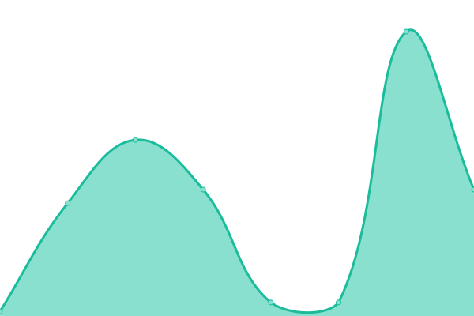
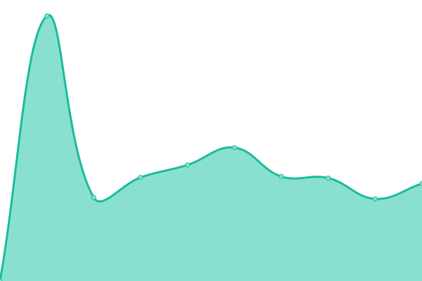

# [📈 Live Status](https://status.37hrd.uk): <!--live status--> **🟧 Partial outage**

This repository contains the open-source uptime monitor and status page for [MMN / SQBX](https://matthewsnetmedia.co.uk), powered by [Upptime](https://github.com/upptime/upptime).

With [Upptime](https://upptime.js.org), you can get your own unlimited and free uptime monitor and status page, powered entirely by a GitHub repository. We use [Issues](https://github.com/MMNmedia/status/issues) as incident reports, [Actions](https://github.com/MMNmedia/status/actions) as uptime monitors, and [Pages](https://status.37hrd.uk) for the status page.

<!--start: status pages-->
<!-- This summary is generated by Upptime (https://github.com/upptime/upptime) -->
<!-- Do not edit this manually, your changes will be overwritten -->
<!-- prettier-ignore -->
| URL | Status | History | Response Time | Uptime |
| --- | ------ | ------- | ------------- | ------ |
|  [MMN - Website](https://www.matthewsnetmedia.co.uk) | 🟩 Up | [mmn-website.yml](https://github.com/MMNmedia/status/commits/HEAD/history/mmn-website.yml) | 

 338ms
     
 | 

<a href="https://status.37hrd.uk/history/mmn-website">100.00%</a>
    

|  [37HRD - Website](https://37hrd.uk) | 🟩 Up | [37-hrd-website.yml](https://github.com/MMNmedia/status/commits/HEAD/history/37-hrd-website.yml) | 

 319ms
     
 | 

<a href="https://status.37hrd.uk/history/37-hrd-website">100.00%</a>
    

|  [37HRD - Tools](https://tools.37hrd.uk) | 🟥 Down | [37-hrd-tools.yml](https://github.com/MMNmedia/status/commits/HEAD/history/37-hrd-tools.yml) | 

 0ms
     
 | 

<a href="https://status.37hrd.uk/history/37-hrd-tools">75.45%</a>
    

|  [37HRD - NAS](https://nas.37hrd.uk) | 🟩 Up | [37-hrd-nas.yml](https://github.com/MMNmedia/status/commits/HEAD/history/37-hrd-nas.yml) | 

 628ms
     
 | 

<a href="https://status.37hrd.uk/history/37-hrd-nas">100.00%</a>
    

|  [SQBX - Website](https://sqbx.uk) | 🟩 Up | [sqbx-website.yml](https://github.com/MMNmedia/status/commits/HEAD/history/sqbx-website.yml) | 

 373ms
     
 | 

<a href="https://status.37hrd.uk/history/sqbx-website">100.00%</a>
    

|  [Cloudflare](https://cloudflare-dns.com) | 🟩 Up | [cloudflare.yml](https://github.com/MMNmedia/status/commits/HEAD/history/cloudflare.yml) | 

 67ms
     
 | 

<a href="https://status.37hrd.uk/history/cloudflare">98.89%</a>
    

|  [CDN Service](https://cdn.matthewsnetmedia.co.uk) | 🟩 Up | [cdn-service.yml](https://github.com/MMNmedia/status/commits/HEAD/history/cdn-service.yml) | 

 349ms
     
 | 

<a href="https://status.37hrd.uk/history/cdn-service">100.00%</a>
    

|  [Emails Service (MX server 1)](mx2.forwardemail.net) | 🟩 Up | [emails-service-mx-server-1.yml](https://github.com/MMNmedia/status/commits/HEAD/history/emails-service-mx-server-1.yml) | 

 54ms
     
 | 

<a href="https://status.37hrd.uk/history/emails-service-mx-server-1">100.00%</a>
    

|  [Emails Service (MX server 2)](mx1.forwardemail.net) | 🟩 Up | [emails-service-mx-server-2.yml](https://github.com/MMNmedia/status/commits/HEAD/history/emails-service-mx-server-2.yml) | 

 75ms
     
 | 

<a href="https://status.37hrd.uk/history/emails-service-mx-server-2">100.00%</a>
    

|  [Emails Service (SMTP server)](smtp.gmail.com) | 🟩 Up | [emails-service-smtp-server.yml](https://github.com/MMNmedia/status/commits/HEAD/history/emails-service-smtp-server.yml) | 

 19ms
     
 | 

<a href="https://status.37hrd.uk/history/emails-service-smtp-server">100.00%</a>
    

|  [Documentation Website (Public)](https://docs.37hrd.uk) | 🟥 Down | [documentation-website-public.yml](https://github.com/MMNmedia/status/commits/HEAD/history/documentation-website-public.yml) | 

 0ms
     
 | 

<a href="https://status.37hrd.uk/history/documentation-website-public">0.00%</a>
    

|  [Client Website - matthew.37hrd.uk](https://matthew.37hrd.uk) | 🟩 Up | [client-website-matthew-37hrd-uk.yml](https://github.com/MMNmedia/status/commits/HEAD/history/client-website-matthew-37hrd-uk.yml) | 

 330ms
     
 | 

<a href="https://status.37hrd.uk/history/client-website-matthew-37hrd-uk">100.00%</a>
    

|  [Client Website - your80s.co.uk](https://your80s.co.uk) | 🟩 Up | [client-website-your80s-co-uk.yml](https://github.com/MMNmedia/status/commits/HEAD/history/client-website-your80s-co-uk.yml) | 

 352ms
     
 | 

<a href="https://status.37hrd.uk/history/client-website-your80s-co-uk">100.00%</a>
    

|  [Client Website - 10yearstheshow.com](https://10yearstheshow.com) | 🟩 Up | [client-website-10yearstheshow-com.yml](https://github.com/MMNmedia/status/commits/HEAD/history/client-website-10yearstheshow-com.yml) | 

 1164ms
     
 | 

<a href="https://status.37hrd.uk/history/client-website-10yearstheshow-com">100.00%</a>
    

|  [Client Website - whatcanido.org.uk](https://whatcanido.org.uk) | 🟩 Up | [client-website-whatcanido-org-uk.yml](https://github.com/MMNmedia/status/commits/HEAD/history/client-website-whatcanido-org-uk.yml) | 

 1807ms
     
 | 

<a href="https://status.37hrd.uk/history/client-website-whatcanido-org-uk">100.00%</a>
    

|  [Client Website - letthechildrensing.org](https://letthechildrensing.org) | 🟩 Up | [client-website-letthechildrensing-org.yml](https://github.com/MMNmedia/status/commits/HEAD/history/client-website-letthechildrensing-org.yml) | 

 1017ms
     
 | 

<a href="https://status.37hrd.uk/history/client-website-letthechildrensing-org">100.00%</a>
    

|  [Client Website - throughtheseeyesfilm.com](https://throughtheseeyesfilm.com) | 🟥 Down | [client-website-throughtheseeyesfilm-com.yml](https://github.com/MMNmedia/status/commits/HEAD/history/client-website-throughtheseeyesfilm-com.yml) | 

 331ms
     
 | 

<a href="https://status.37hrd.uk/history/client-website-throughtheseeyesfilm-com">75.47%</a>
    

|  [Client Website - standrewsurccardiff.co.uk](https://standrewsurccardiff.co.uk) | 🟩 Up | [client-website-standrewsurccardiff-co-uk.yml](https://github.com/MMNmedia/status/commits/HEAD/history/client-website-standrewsurccardiff-co-uk.yml) | 

 389ms
     
 | 

<a href="https://status.37hrd.uk/history/client-website-standrewsurccardiff-co-uk">100.00%</a>
    

|  [Client Website - jwrecovery.co.uk](https://jwrecovery.co.uk) | 🟩 Up | [client-website-jwrecovery-co-uk.yml](https://github.com/MMNmedia/status/commits/HEAD/history/client-website-jwrecovery-co-uk.yml) | 

 1345ms
     
 | 

<a href="https://status.37hrd.uk/history/client-website-jwrecovery-co-uk">100.00%</a>
    

|  [Client Website - retraace.co.uk](https://retraace.co.uk) | 🟩 Up | [client-website-retraace-co-uk.yml](https://github.com/MMNmedia/status/commits/HEAD/history/client-website-retraace-co-uk.yml) | 

 377ms
     
 | 

<a href="https://status.37hrd.uk/history/client-website-retraace-co-uk">100.00%</a>
    

|  [Client Website - peteholdstock.co.uk](https://peteholdstock.co.uk) | 🟥 Down | [client-website-peteholdstock-co-uk.yml](https://github.com/MMNmedia/status/commits/HEAD/history/client-website-peteholdstock-co-uk.yml) | 

 358ms
     
 | 

<a href="https://status.37hrd.uk/history/client-website-peteholdstock-co-uk">75.48%</a>
    

<!--end: status pages-->

## License

- Code: [MIT](./LICENSE) © [MMN / SQBX](https://matthewsnetmedia.co.uk)
- Data in the `./history` directory: [Open Database License](https://opendatacommons.org/licenses/odbl/1-0/)
